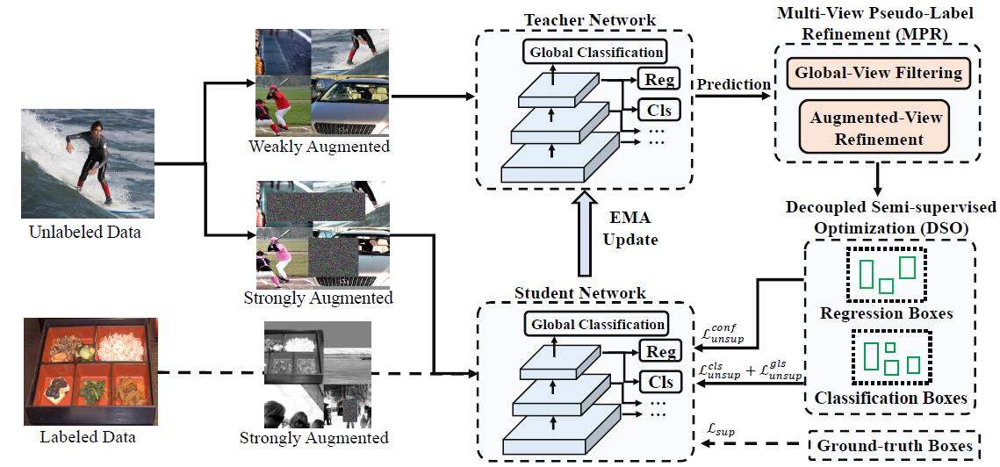

# OneTeacher

Official implementation of "Towards End-to-end Semi-supervised Learning for One-stage Object Detection".
OneTeacher is a semi-supervised framework for YOLOV5, which is equiped with two novel designs, namely Multi-view Pseudo-label Refinement and Decoupled Semi-supervised Optimization.

<p align="center">
	
</p>

## Updates 
- (2023/1/29) Release our RepAdapter project.

## Data Preparation
1. Prepare the datasets of COCO and VOC, please refer to [YOLOv5](./README_YOLOV5.md)

After that, the file structure should look like:
```
   |-- OneTeacher
   |-- datasets
       |-- coco
             |-- images
                  |-- train2017
                  |-- val2017
                  |-- test2017
             |-- labels
             |-- annotations
                  |-- instances_train2017.json
                  |-- instances_val2017.json
```
2. Generate semi-supervised data split.
```
python active_sampling/generate_random_supervised_seed_yolo.py  --dataset_name 'coco_2017_train'  --random_seeds 0,1,2,3,4,5,6,7,8,9  --random_file  ./data_processing/COCO_supervision.txt   --random_percent 10.0  --output_file ./dataseed/COCO_supervision_10.json
```
## Training and Evaluation
Semi-supervised Learning on COCO 10%
```sh 
bash script/coco_semi_script.sh 32 2 0,1
``` 
Semi-supervised Learning on VOC 25%
```sh 
bash script/voc_semi_script.sh 32 2 0,1
``` 
Fully-supervised Learning on COCO 10%
```sh 
bash script/coco_fully_script.sh 32 2 0,1
``` 
Fully-supervised Learning on VOC 25%
```sh 
bash script/voc_fully_script.sh 32 2 0,1
``` 